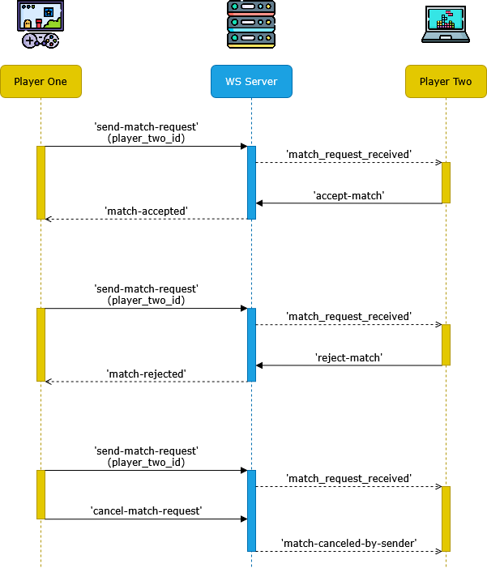

# Eventos de configuración del jugador (Player)

> Si necesitas volver al documento anterior, haz clic [aquí](./server-connect-and-use-es.md).

- [Resumen de eventos](#resumen-de-eventos)
- [Solicitud de partida recibida](#solicitud-de-partida-recibida)
- [Partida cancelada por el remitente](#partida-cancelada-por-el-remitente)
- [Solicitud de partida aceptada](#solicitud-de-partida-aceptada)
- [Solicitud de partida rechazada](#solicitud-de-partida-rechazada)
- [Enviar solicitud de partida](#enviar-solicitud-de-partida)
- [Cancelar solicitud de partida]()
- [Aceptar solicitud de partida]()
- [Rechazar solicitud de partida]()

El servidor puede gestionar las solicitudes de partidas realizadas entre jugadores. En este caso, cada jugador puede 
enviar solicitudes de partida a otros jugadores que se encuentren disponibles (`AVAILABLE`). Los jugadores que reciben
la solicitud pueden aceptar o rechazar la solicitud de partida como estimen conveniente. El jugador que envía la solicitud
también puede cancelarla si el jugador destinatario aún no ha respondido dentro del tiempo establecido. Las solicitudes de
partida expirarán al cabo de 30 segundos. En dicho caso, cuando se envie una solicitud de cancelación, aprobación o rechazo,
la solicitud fallará con el mensaje respectivo.

## Resumen de eventos

| Nombre                             | Evento                   | Tipo     | Descripción                                                          |
|------------------------------------|--------------------------|----------|----------------------------------------------------------------------|
| Solicitud de partida recibida      |`match-request-received`  | Entrante | Avisa que recibiste una solicitud de partida.                        |
| Partida cancelada por el remitente |`match-canceled-by-sender`| Entrante | Avisa que la solicitud de partida fue cancelada por el otro jugador. |
| Solicitud de partida aceptada      |`match-accepted`          | Entrante | Avisa que el otro jugador aceptó la solicitud de partida.            |
| Solicitud de partida rechazada     |`match-rejected`          | Entrante | Avisa que el otro jugador rechazó la solicitud de partida.           |
| Enviar solicitud de partida        |`send-match-request`      | Saliente | Manda una solicitud de partida a un jugador disponible.              |
| Cancelar solicitud de partida      |`cancel-match-request`    | Saliente | Cancela la solicitud enviada al otro jugador.                        |
| Aceptar solicitud de partida       |`accept-match`            | Saliente | Acepta una solicitud de partida recibida.                            |
| Rechazar solicitud de partida      |`reject-match`            | Saliente | Rechaza una solicitud de partida recibida.                           |

<details>
<summary>Diagrama de secuencia de eventos</summary>



</details>

## Solicitud de partida recibida

| Resumen         |                                                                                        |
|-----------------|----------------------------------------------------------------------------------------|
| __Evento__      | `match-request-received`                                                               |
| __Tipo__        | Evento entrante (_Listen_).                                                            |
| __Descripción__ | Evento que indica que se ha recibido una solicitud de partida por parte de un jugador. |
| __Respuesta__   | `playerId` (_string_): ID de jugador que ha enviado la solicitud de partida.           |
|                 | `matchId` (_string_): ID de la partida asociada a la solicitud.                        |

Este evento se recibe cuando otro jugador le ha enviado una solicitud de partida. Esta solicitud estará activa 
durante 30 segundos a menos que el jugador contrincante cancele la solicitud. Dentro de este tiempo, usted
puede aprobar o rechazar la solicitud con `accept-match` y `reject-match` respectivamente. Puede usar este
mensaje para abrir una ventana modal en su interfaz, con el fin que el jugador ejecute una de las dos acciones.

Ejemplo de respuesta:
```jsonc
{
  "event": "match-request-received",
  "msg": "Match request received from player 'Player_One'",
  "data": {
    "playerId": "0f2cc688-dcf3-4952-b8f8-c52f75f316d4",
    "matchId": "30c3d082-bcd9-48b0-9a90-76212636bc6f"
  }
}
```

## Partida cancelada por el remitente

| Resumen         |                                                                         |
|-----------------|-------------------------------------------------------------------------|
| __Evento__      | `match-canceled-by-sender`                                              |
| __Tipo__        | Evento entrante (_Listen_).                                             |
| __Descripción__ | Evento que indica que se ha cancelado la solicitud de partida recibida. |
| __Respuesta__   | `playerId` (_string_): ID de jugador que ha enviado el mensaje.         |
|                 | `playerName` (_string_): ID de la partida asociada a la solicitud.      |

Este evento se recibe cuando otro jugador le envió una solicitud de partida, pero la cancelo
posteriormente. Puede usar este mensaje para borrar la ventana modal de solicitud de partida.

Ejemplo de respuesta:
```jsonc
{
  "event": "match-request-received",
  "msg": "Player 'Player_One' has cancelled the match request.",
  "data": {
    "playerId": "0f2cc688-dcf3-4952-b8f8-c52f75f316d4",
    "playerName": "Player_One"
  }
}
```

## Solicitud de partida aceptada

| Resumen         |                                                                                 |
|-----------------|---------------------------------------------------------------------------------|
| __Evento__      | `match-accepted`                                                                |
| __Tipo__        | Evento entrante (_Listen_).                                                     |
| __Descripción__ | Evento que indica que el jugador desafiado ha aceptado la solicitud de partida. |
| __Respuesta__   | `playerId` (_string_): ID de jugador que aceptó la solicitud de partida.        |
|                 | `playerName` (_string_): Nombre del jugador que aceptó la solicitud de partida. |
|                 | `matchId` (_string_): ID de la partida asociada a la solicitud.                 |
|                 | `matchStatus` (_string_): Estado de la partida.                                 |

Este evento se recibe cuando el jugador que ha desafiado aceptó la solicitud de partida. En este caso, el 
jugador puede usar este evento para pasar a una ventana de configuración o bien directamente a la escena
del multijugador.

Ejemplo de respuesta:
```jsonc
{
  "event": "match-accepted",
  "msg": "Player 'Player_Two' has rejected your match request.",
  "data": {
    "playerId": "c3e5aca7-f1c0-40ed-8b5c-aac3f58d137f",
    "playerName": "Player_Two",
    "matchId": "97eb7a3c-1f9e-412a-b379-dc17d868b7a1",
    "matchStatus": "WAITING_PLAYERS"
  }
}
```

## Solicitud de partida rechazada

| Resumen         |                                                                                  |
|-----------------|----------------------------------------------------------------------------------|
| __Evento__      | `match-rejected`                                                                 |
| __Tipo__        | Evento entrante (_Listen_).                                                      |
| __Descripción__ | Evento que indica que el jugador desafiado ha rechazado la solicitud de partida. |
| __Respuesta__   | `playerId` (_string_): ID de jugador que rechazó la solicitud.                   |
|                 | `playerName` (_string_): Nombre del jugador que rechazó la solicitud.            |

Este evento se recibe cuando el jugador que ha desafiado rechazó la solicitud de partida. Puede usar este
mensaje para borrar la ventana modal de solicitud de partida.

Ejemplo de respuesta:
```jsonc
{
  "event": "match-rejected",
  "msg": "Player 'Player_Two' has rejected your match request.",
  "data": {
    "playerId": "c3e5aca7-f1c0-40ed-8b5c-aac3f58d137f",
    "playerName": "Player_Two"
  }
}
```

## Enviar solicitud de partida

| Resumen         |                                                                         |
|-----------------|-------------------------------------------------------------------------|
| __Evento__      | `send-match-request`                                                    |
| __Tipo__        | Evento saliente (_Trigger_).                                            |
| __Descripción__ | Evento para enviar una solicitud de partida a otro jugador.             |
| __Parámetros__  | `playerId` (_string_): Identificador del jugador a enviar la solicitud. |
| __Respuesta__   | `matchId` (_string_): ID de la partida asociada a la solicitud.         |


```jsonc
// Evento enviado por el jugador
{
  "event": "send-match-request",
  "data": {
    "playerId": "c3e5aca7-f1c0-40ed-8b5c-aac3f58d137f",
  }
}

// Respuesta entregada por el servidor
{
  "event": "send-match-request",
  "status": "OK",
  "msg": "Match request sent to player 'Player_Two'.",
  "data": {
    "matchId": "30c3d082-bcd9-48b0-9a90-76212636bc6f"
  }
}
```